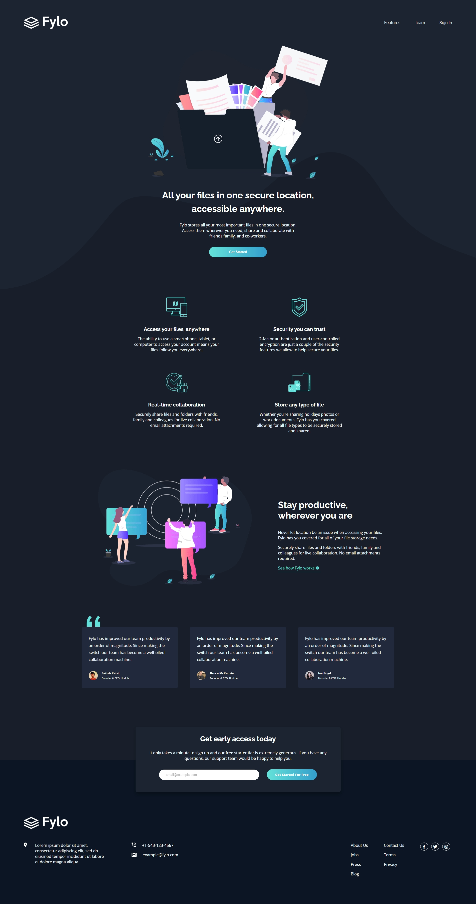
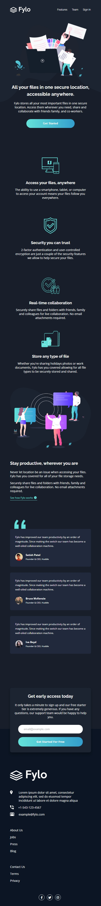

# Frontend Mentor - Fylo dark theme landing page solution

This is a solution to the [Fylo dark theme landing page challenge on Frontend Mentor](https://www.frontendmentor.io/challenges/fylo-dark-theme-landing-page-5ca5f2d21e82137ec91a50fd). Frontend Mentor challenges help you improve your coding skills by building realistic projects.

## Table of contents

- [Overview](#overview)
  - [The challenge](#the-challenge)
  - [Screenshot](#screenshot)
  - [Links](#links)
- [My process](#my-process)
  - [Built with](#built-with)
  - [What I learned](#what-i-learned)
  - [Useful resources](#useful-resources)
- [Author](#author)

## Overview

### The challenge

Users should be able to:

- View the optimal layout for the site depending on their device's screen size
- See hover states for all interactive elements on the page

### Screenshot

### Links

- Live Site URL: https://fylo-dark-theme-landing-page-psi-orpin.vercel.app/

## My process

### Built with

- Semantic HTML5 markup
- SASS
- Flexbox
- CSS Grid
- Mobile-first workflow
- Fluid Typography

### What I learned

In this project I learned how to make the typography fuild by using the clamp function. I also used this project to practice how to make a landing page by using CSS Grid, CSS Flexbox, and more.

### Useful resources

- [Fluid Typography](https://youtu.be/dg488RrpNTc) - I used this video to learn about the clamp function and how to use it to make the typography fluid.

## Author

- Frontend Mentor - [@JacksonJ97](https://www.frontendmentor.io/profile/JacksonJ97)
